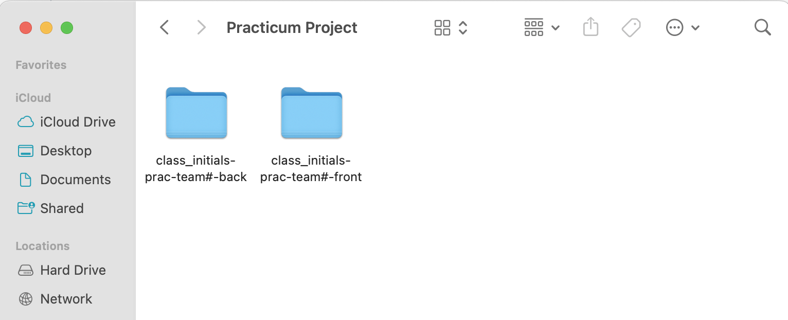

# Front-End Repo for Pet Watch

## Table of contents

* [Description](#description)
* [Demo](#demo)
* [Technology](#technology)
* [API Routers](#routers)
* [Database Schema](#database)
* [Setup](#setup)

## Description 

At Pet Watch, our mission is simple yet profound: to reunite lost pets with their worried families. We understand the deep bond between humans and their four-legged companions, and the heartache that ensues when a pet goes missing. That's why we've created a platform that harnesses the power of community, technology, and compassion to increase the chances of finding lost pets and bringing them back home where they belong.

Pet Watch is a React-Node application. Pet Watch provides an easy way to search the lost and found pet database and to communicate with the user who posted the pet.   

## Demo (screenshots)

Once the Get Started button is clicked the user will be presented with the option of logining in or registering. 

After the user is signed in they will be directed to the dashboard page that includes the map along with the live dashboard of lost and found animals. The map side has either blue or pink markers to indicate the location of a lost or found pet. A blue marker means it is a found pet while a pink one means it is a lost one.

On the upper left side of the dashboard page will be the add button and once selected the user will be taken to the add pet page. 

Once they are at the add pet page they can use the toggle button to post either a lost or found pet. 

The purple button on the upper right side can be clicked to display the profile page. The user information is on the left and to the right is a table of all the pets that are added for that user.

The user can either delete a pet or edit the information of a pet by clicking the edit button. Once clicked they will be redericted to the edit pet information page. Once they are ther they can update any of the input fields and clicke update. When they are done they can click on the purple arrow on the left upper side and will be taken back to the profile page and will see the updated information. 

## Contributors

- Luis ([GitHub](https://github.com/Count-MonteCristo))
- Jennifer ([GitHub](https://github.com/JenMcD-star))
- Mariela ([GitHub](https://github.com/Mariela-t))
- Tracy ([GitHub](https://github.com/trca831))
- Mariana ([GitHub](https://github.com/Maarimar))

# Front-End Repo for Node/React Practicum

This will be the front-end for your team's practicum project.

It is suggested that you run these instructions **after** you setup the back-end server first.
You can go through these steps during your first group meeting in case you need assistance from your mentors.

You will have two folders inside one team folder (one for front-end and one for back-end). Name the parent folder something appropriate (in the below example we title it "Practicum Project").  Then clone directly (do not fork and clone) the front and back repos while inside the parent ("Practicum Project") project folder.

>The front-end app (React) will be running on port 3000. The back-end server will be running on port 8000. You will need to run both the front-end app and the back-end server at the same time to test your app.

### Setting up local development environment

1. Clone this repository to the folder that was already created for both the front-end and back-end repos
2. Run `npm install` to install dependencies
3. Pull the latest version of the `main` branch (when needed)
4. Run `npm start` to start the development server
5. Open http://localhost:3000 with your browser to see the data received the back-end server.
6. Now you have your front-end and back-end running locally!

#### Running the front-end server in Visual Studio Code
Note: In the below example, the group's front-end repository was named `bb-practicum-team1-front` and the back-end repository was named `bb-practicum-team-1-back`.  Your repository will have a different name, but the rest should look the same.

#### Running the front-end server in the browser

